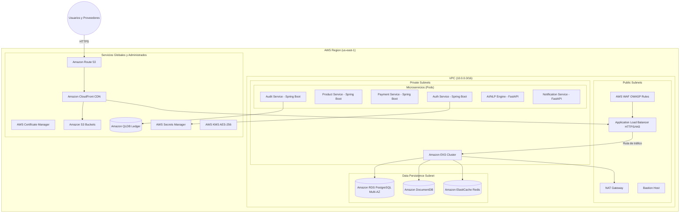

# Arquitectura Cloud EcoMarket (AWS)

## Diagrama de Red y Servicios

## Componentes Principales

1. **API Gateway & Routing**: El tráfico de usuarios llega a Route 53, pasa por CloudFront (CDN para PWA) y luego al Application Load Balancer. Un WAF protege contra ataques OWASP.
2. **Compute**: Amazon EKS gestiona contenedores para los microservicios en Spring Boot y FastAPI dentro de subredes privadas, asegurando que no haya exposición a internet pública.
3. **Persistencia**:
    - **PostgreSQL (RDS)**: Para transacciones, usuarios, pagos.
    - **DocumentDB**: Para resultados NLP de ingredientes y JSON dinámicos.
    - **Amazon QLDB**: Libro mayor inmutable para trazabilidad y auditoría de productos.
4. **Seguridad**: Secretos y claves (MFA, Webhooks) almacenados en AWS Secrets Manager, encriptación con KMS.
