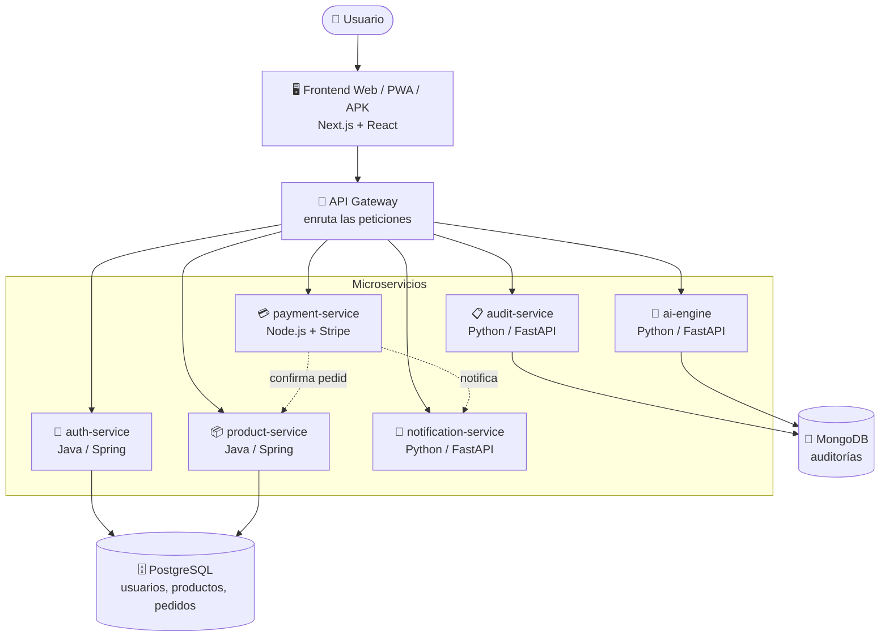

# 2. Arquitectura

## 2.1 Estilo arquitectónico: Microservicios

EcoMarket está construido con **arquitectura de microservicios**. En vez de una sola aplicación monolítica, el sistema se divide en **servicios pequeños e independientes**, cada uno responsable de una función específica, que se comunican entre sí a través de un **API Gateway**.

**Ventajas:**
- Cada servicio se desarrolla, prueba y despliega por separado.
- Si un servicio falla, no necesariamente cae todo el sistema.
- Se puede usar la tecnología más adecuada para cada tarea (Java, Node.js, Python).
- Facilita el escalado independiente de cada parte.

## 2.2 Diagrama de arquitectura

## 2.3 Componentes y responsabilidades

| Componente | Tecnología | Responsabilidad | Puerto |
|-----------|-----------|-----------------|--------|
| Frontend Web | Next.js / React | Interfaz de usuario (web, PWA, APK) | 3000 |
| API Gateway | Node.js / Kong | Punto de entrada y enrutamiento | 8000 |
| auth-service | Java / Spring Boot | Registro, login, seguridad (JWT) | 8081 |
| product-service | Java / Spring Boot | Catálogo, pedidos, inventario, auditoría | 8082 |
| payment-service | Node.js / Express | Procesamiento de pagos (Stripe, Yape, Plin) | 8083 |
| audit-service | Python / FastAPI | Certificación y trazabilidad | 8084 |
| ai-engine | Python / FastAPI | Cálculo del Eco-Score | 8085 |
| notification-service | Python / FastAPI | Notificaciones al usuario | 8086 |
| PostgreSQL | Base de datos SQL | Usuarios, productos, pedidos | 5432 |
| MongoDB | Base de datos NoSQL | Registros de auditoría | 27017 |

## 2.4 Comunicación entre servicios

- El **frontend** nunca habla directamente con los microservicios: siempre pasa por el **API Gateway**.
- El Gateway **enruta** cada petición según la ruta (`/api/auth` → auth-service, `/api/products` → product-service, etc.).
- Algunos servicios se comunican entre sí de forma interna (por ejemplo, **payment-service** avisa a **product-service** para confirmar un pedido, y a **notification-service** para notificar al usuario). Estas llamadas internas se protegen con un **secreto compartido**.

## 2.5 Stack tecnológico resumido

- **Lenguajes:** Java 17, JavaScript/TypeScript (Node.js), Python 3.11.
- **Frameworks:** Spring Boot, Express, FastAPI, Next.js/React.
- **Bases de datos:** PostgreSQL, MongoDB.
- **Contenedores:** Docker / Docker Compose.
- **Despliegue:** Vercel (frontend), Render (backend), Capacitor (APK).
