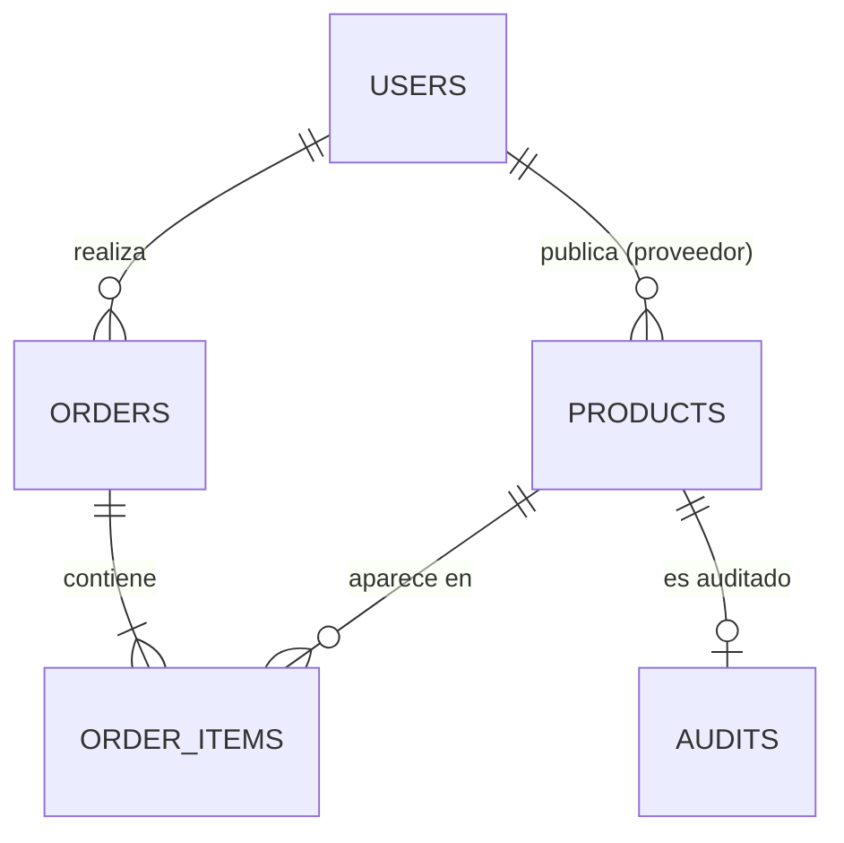

# 5. Base de datos

EcoMarket usa **dos bases de datos** según el tipo de información:

- **PostgreSQL** (relacional) → usuarios, productos y pedidos.
- **MongoDB** (NoSQL) → registros de auditoría.

## 5.1 PostgreSQL

### Tabla `users` (usuarios)
| Campo | Tipo | Descripción |
|-------|------|-------------|
| id | UUID | Identificador único |
| email | texto (único) | Correo del usuario |
| full_name | texto | Nombre completo |
| provider | texto | Origen de la cuenta ("email") |
| provider_id | texto | Contraseña cifrada (BCrypt) |
| role | texto | `customer`, `provider` o `admin` |
| eco_score | entero | Puntaje ecológico del usuario |
| created_at | fecha/hora | Fecha de creación |

### Tabla `products` (productos)
| Campo | Tipo | Descripción |
|-------|------|-------------|
| id | UUID | Identificador único |
| provider_id | UUID | Proveedor dueño del producto |
| name | texto | Nombre |
| description | texto | Descripción |
| price | decimal | Precio |
| stock | entero | Unidades disponibles |
| category | texto | Categoría |
| eco_score | entero | Puntaje ecológico (0–100) |
| images | texto[] | Imágenes |
| origen_region | texto | Región de origen |
| fecha_produccion | fecha | Fecha de producción |
| fecha_vencimiento | fecha | Fecha de vencimiento |
| status | texto | `PENDING`, `APPROVED`, `REJECTED` |
| motivo_rechazo | texto | Motivo si fue rechazado |
| created_at | fecha/hora | Fecha de creación |

### Tabla `orders` (pedidos)
| Campo | Tipo | Descripción |
|-------|------|-------------|
| id | UUID | Identificador del pedido |
| customer_id | UUID | Cliente que compra |
| total_amount | decimal | Monto total |
| platform_fee | decimal | Comisión de la plataforma |
| status | texto | `pending`, `paid` |
| paid_at | fecha/hora | Fecha de pago |
| created_at | fecha/hora | Fecha de creación |

### Tabla `order_items` (ítems del pedido)
| Campo | Tipo | Descripción |
|-------|------|-------------|
| id | UUID | Identificador |
| order_id | UUID | Pedido al que pertenece |
| product_id | UUID | Producto comprado |
| provider_id | UUID | Proveedor del producto |
| quantity | entero | Cantidad |
| unit_price | decimal | Precio unitario |
| subtotal | decimal | Subtotal |

## 5.2 MongoDB

### Colección `audits` (auditorías)
Guarda el resultado de la auditoría de cada producto:
- `product_id` — producto auditado.
- `status` — resultado (APPROVED / REJECTED).
- `eco_score` — puntaje otorgado.
- `badges` — sellos obtenidos.
- `audit_hash` — huella única de la auditoría.
- `details` — auditor, observaciones y fecha.

## 5.3 Relación entre entidades

