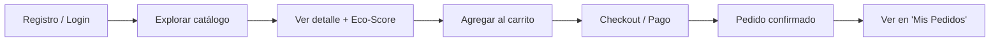
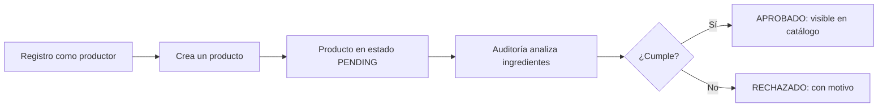

# 9. Roles y flujos

## 9.1 Roles de usuario

| Rol | Quién es | Qué puede hacer |
|-----|----------|-----------------|
| **Consumidor** (`customer`) | Comprador | Explorar catálogo, agregar al carrito, comprar, ver sus pedidos |
| **Productor** (`provider`) | Vendedor | Publicar productos (pasan por auditoría), gestionar sus productos |
| **Administrador** (`admin`) | Gestor de la plataforma | Aprobar/rechazar productos, auditar, gestionar usuarios |

## 9.2 Flujo de compra (consumidor)

1. El consumidor se **registra** o **inicia sesión**.
2. **Explora** el catálogo (solo productos aprobados, con su Eco-Score).
3. Revisa el **detalle** y la trazabilidad del producto.
4. Lo **agrega al carrito**.
5. Va al **checkout** y paga (Yape, Plin, TuPay o tarjeta).
6. El **pedido queda registrado** y confirmado.

## 9.3 Flujo de publicación (productor)

1. El productor se **registra** (con validación de datos fiscales/RUC).
2. **Crea un producto**, que queda en estado **PENDING** (pendiente).
3. El sistema **analiza** los ingredientes y calcula el Eco-Score.
4. El **administrador** aprueba o rechaza.
5. Si se **aprueba**, el producto aparece públicamente en el catálogo.

## 9.4 Flujo de auditoría (administrador)

1. El admin entra al **panel de administración**.
2. Ve la lista de productos **pendientes**.
3. Revisa la información y el análisis de ingredientes.
4. **Aprueba** (el producto se publica) o **rechaza** (indicando el motivo).
5. Puede **generar un certificado PDF** de la auditoría.
